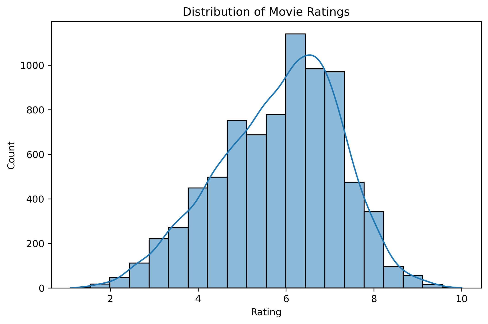
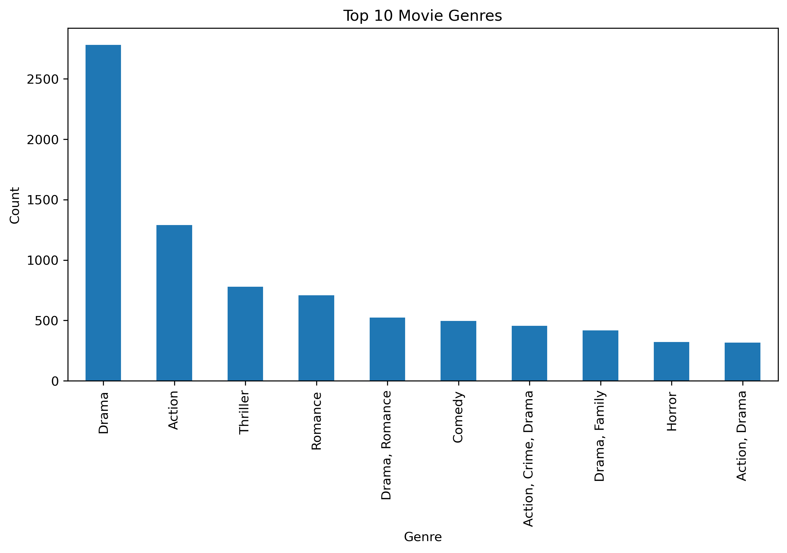
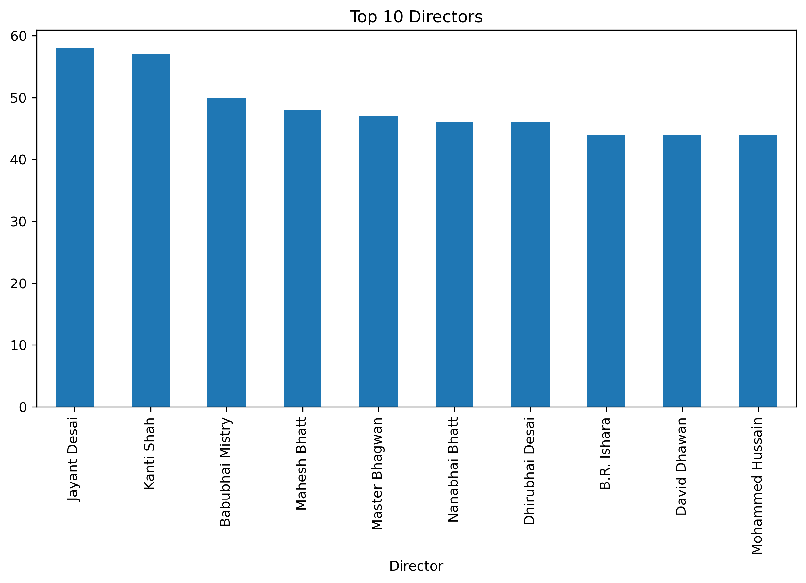
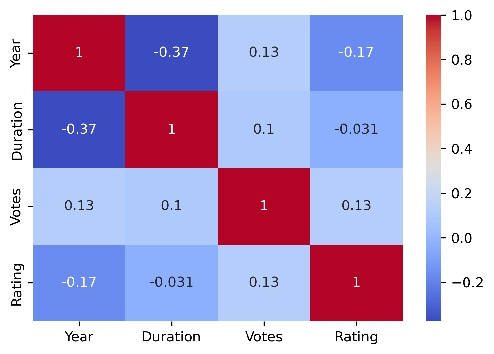

# 🎬 Movie Rating Prediction with Python

## 📌 Project Overview

Movie Rating Prediction is a Machine Learning project that predicts the IMDb rating of Indian movies based on features such as **Genre**, **Director**, **Actors**, **Release Year**, **Duration**, and **Number of Votes**.

The project demonstrates the complete machine learning workflow, including data preprocessing, exploratory data analysis (EDA), feature engineering, model building, evaluation, and prediction using regression algorithms.

---

## 📂 Dataset

* **Dataset:** IMDb India Movies
* **Source:** Kaggle
* **Provider:** Adrian McMahon
* **Download Method:** `kagglehub`

The dataset contains information about Indian movies, including movie details and user ratings.

---

## 🎯 Objective

The objective of this project is to build a regression model that accurately predicts movie ratings using historical movie data. By analyzing factors such as genre, director, actors, release year, duration, and votes, the model estimates the expected rating of a movie.

---

## 🛠 Technologies Used

* Python
* Pandas
* NumPy
* Matplotlib
* Seaborn
* Scikit-learn
* KaggleHub
* Jupyter Notebook

---

## 📊 Exploratory Data Analysis (EDA)

The following analyses were performed:

* Dataset overview
* Missing value analysis
* Duplicate value detection
* Rating distribution
* Top 10 movie genres
* Top 10 directors
* Ratings vs Release Year
* Correlation heatmap

---

## 🧹 Data Preprocessing

The dataset was cleaned by:

* Removing rows with missing ratings
* Extracting numeric values from the **Year** column
* Converting **Duration** into numeric minutes
* Cleaning the **Votes** column by removing commas
* Handling missing values
* Removing duplicate records

---

## ⚙️ Feature Engineering

### Input Features

* Genre
* Director
* Actor 1
* Actor 2
* Actor 3
* Year
* Duration
* Votes

### Target Variable

* Rating

Categorical features were encoded using **OneHotEncoder**, while numerical features were processed using a preprocessing pipeline.

---

## 🤖 Machine Learning Models

Two regression models were trained and compared:

1. Linear Regression
2. Random Forest Regressor

---

## 📈 Model Evaluation

The models were evaluated using:

* Mean Absolute Error (MAE)
* Root Mean Squared Error (RMSE)
* R² Score

The model with the highest R² Score and lowest prediction error was selected as the final model.

---

## 🎯 Predicting Movie Ratings

After training, the model can predict the rating of a new movie based on:

* Genre
* Director
* Actors
* Release Year
* Duration
* Votes

---

## 📁 Project Structure

```text
Movie-Rating-Prediction/
│
├── Movie_Rating_Prediction.ipynb
├── README.md
├── requirements.txt
├── .gitignore
├── images/
│   ├── rating_distribution.png
│   ├── top_genres.png
│   ├── top_directors.png
│   ├── correlation_heatmap.png
│   └── model_comparison.png
```

---

## 🚀 How to Run the Project

### 1. Clone the Repository

```bash
git clone https://github.com/deepthireddy2605/Movie-Rating-Prediction.git
```

### 2. Install Required Libraries

```bash
pip install -r requirements.txt
```

### 3. Run the Jupyter Notebook

```bash
jupyter notebook
```

Open **Movie_Rating_Prediction.ipynb** and execute all cells.

---

## 📸 Project Screenshots

Add your generated visualizations inside the **images** folder and include them here.

### Rating Distribution



### Top Movie Genres



### Top Directors



### Correlation Heatmap



---

## 📌 Results

* Successfully cleaned and preprocessed the IMDb India Movies dataset.
* Built and evaluated multiple regression models.
* Compared model performance using MAE, RMSE, and R² Score.
* Predicted movie ratings based on movie metadata.

---

## 🔮 Future Enhancements

* Hyperparameter tuning using GridSearchCV or RandomizedSearchCV
* Feature selection and importance analysis
* Model deployment using Flask or Streamlit
* Integration with a movie recommendation system
* Experiment with XGBoost, LightGBM, or CatBoost

---

## 👩‍💻 Author

**Deepthi Kalluri**

Computer Science Graduate | Aspiring Data Analyst & Machine Learning Enthusiast

* GitHub: https://github.com/deepthireddy2605
* LinkedIn: https://www.linkedin.com/in/deepthi-kalluri-274748280/

---

## ⭐ If you found this project useful, consider giving it a star on GitHub!
